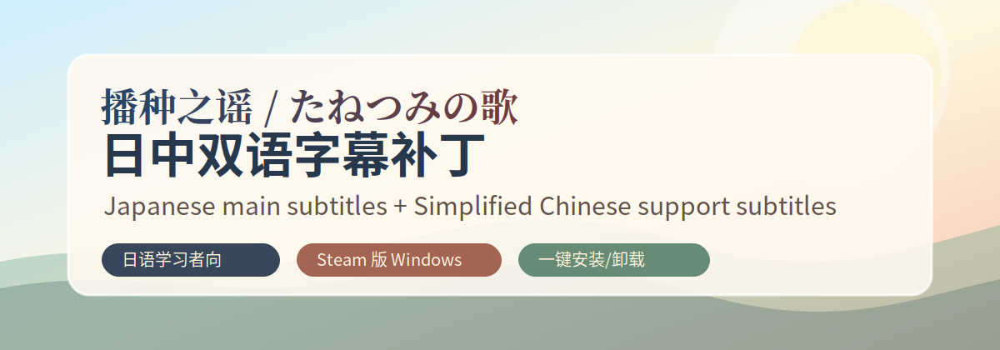

<p align="center">
  
</p>

# Tanetsumi no Uta Bilingual Subtitle Patch

[中文](README.md) | [English](README.en.md) | [日本語](README.ja.md)

[](https://github.com/RubyonLy0929/tanetsumi-bilingual-subtitle-patch/releases/latest)
[](https://steamcommunity.com/sharedfiles/filedetails/?id=3753328194)
[](LICENSE)
[](https://store.steampowered.com/app/2748830/)

An unofficial bilingual subtitle patch for **Tanetsumi no Uta / たねつみの歌 / 播种之谣**, made for Japanese learners. It keeps the official Japanese subtitle as the main line and shows Simplified Chinese as a smaller support subtitle below it.

If this project helps you, starring the repository helps other Japanese learners find it.

## Download

- Recommended: [latest release package](https://github.com/RubyonLy0929/tanetsumi-bilingual-subtitle-patch/releases/latest)
- Manual install file: [tanetsumi.pfs.099](dist/tanetsumi.pfs.099?raw=1)
- Chinese Steam guide with screenshots: https://steamcommunity.com/sharedfiles/filedetails/?id=3753328194

## What It Does

| Position | Text | Notes |
| --- | --- | --- |
| Upper line | Official Japanese subtitle | Preserves the large main subtitle style |
| Lower line | Official Simplified Chinese subtitle | Smaller pale-yellow support subtitle |
| UI | In-game language setting | Menus and settings still follow the game option |

Search keywords: Tanetsumi no Uta bilingual subtitles, Japanese learning visual novel patch, たねつみの歌 二言語字幕, 播种之谣双语字幕.

## Quality Check

This version was scanned against the full script set:

- 83 scenario files
- 16,712 dialogue blocks
- no detected out-of-bounds or dangerous overlap cases
- about 56 px of bottom margin remained in the tightest long-line case

## Supported Version

- Game: Steam version of Tanetsumi no Uta / たねつみの歌 / 播种之谣
- Steam App ID: `2748830`
- Platform: Windows
- Patch file: `tanetsumi.pfs.099`

If a future game update breaks subtitle display, uninstall this patch first and wait for an adapted version.

## Install

### Option 1: install script

1. Download `tanetsumi-bilingual-subtitle-patch-v1.0.0.zip`.
2. Extract it anywhere.
3. Run `install.bat`.
4. If the script cannot find the game folder, enter the folder that contains `tanetsumi.exe`.
5. Restart the game.

### Option 2: manual install

1. Download `tanetsumi.pfs.099`.
2. Open the Steam local files folder for the game.
3. Put `tanetsumi.pfs.099` next to `tanetsumi.exe`.
4. Restart the game.

## Uninstall

Run `uninstall.bat`, or manually delete `tanetsumi.pfs.099` from the game folder.

## Checksums

```text
tanetsumi.pfs.099
SHA256: C08151EF0AF6F44261CBD3EACB90C9FF1C37D0723A639C7D63011F591F4F6BAB

tanetsumi-bilingual-subtitle-patch-v1.0.0.zip
SHA256: 8701762948EE1ABF04C332C2C6BB3BCCC31059A63A36F4D32C34A221E2FC0FF3
```

## Disclaimer

This is an unofficial fan-made patch. It is not affiliated with the developer, publisher, Steam, or any rights holder. It does not include the game, scenario text, images, audio, video, or DRM bypasses. Please use it only with a legally purchased Steam copy of the game.
